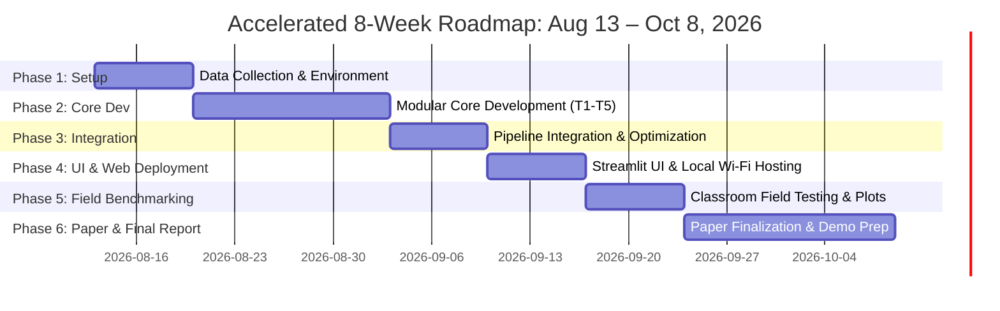

# Project Roadmap & Modular Team Assignment Plan

**Project Title**: Automated CPU-Oriented Classroom Attendance System  
**Timeline**: Thursday, August 13, 2026 – Thursday, October 8, 2026 (~8 Weeks / 56 Days Execution Window)  
**Team Structure**: 5 Teammates  

---

## 1. Modular Role & Responsibility Distribution

To ensure zero overlap and clean parallel development, the system is split into **5 distinct technical modules**. Each teammate owns a primary module end-to-end:

| Teammate | Assigned Role & Module | In Plain Terms | Primary Responsibilities | Core Deliverables & Tools |
| :--- | :--- | :--- | :--- | :--- |
| **Teammate 1** *(Lead Architect, Runtime Owner & Integration Coordinator)* | **Module 1: Video Ingestion, Streamlit Web UI, Environment Packaging & Integration** | Because the final app runs and hosts entirely on **Teammate 1's laptop**, Teammate 1 is not just building Module 1 — Teammate 1 is also the one who (a) sets up the single shared environment everyone else's code has to run inside, and (b) physically merges all 5 modules together in Phase 3, since that only happens on that one machine. This is realistically the biggest role on the team — see the workload note below. | • Video capture ingestion & 4 FPS temporal subsampling *(reads the video and keeps ~4 frames per second instead of all 30, to keep things fast)*. • Streamlit Web App interface (`app.py`) *(the upload page / dashboard)*. • Local Wi-Fi network hosting (`http://<ip>:8501`) *(so a teacher's phone can open the app over the classroom Wi-Fi, no internet needed — runs on Teammate 1's machine)*. • Multithreaded producer-consumer queue *(lets the app keep working in the background instead of freezing while it processes)*. • **Owns the shared `requirements.txt`** with pinned versions for every library the other 4 modules need (OpenCV, ONNX Runtime, InsightFace, PyTorch-for-MTCNN, ultralytics-for-YOLOv8, scikit-learn, Streamlit) — since everything has to coexist in one environment on that one laptop without version conflicts. • **Owns Phase 3 integration**: pulls each teammate's finished, tested script into the pipeline on that machine; other teammates pair with Teammate 1 to fix their own module when something breaks during wiring. | • Streamlit Web Dashboard. • Frame Sampler script (`cv2.VideoCapture`). • Local Network deployment setup. • `requirements.txt` / environment setup script. • Fully merged, runnable pipeline. |
| **Teammate 2** *(Computer Vision Preprocessing Engineer)* | **Module 2: Motion Blur Filtering & Homography Compensation** | Teammate 2 throws out the blurry frames caused by the teacher walking/panning, and figures out how much the camera moved between frames. | • Blur detection via Variance of Laplacian *(a standard "how sharp is this photo" score — low score = blurry, gets dropped)*. • ORB/SIFT feature point matching *(finds matching landmarks between two frames to measure camera movement)*. • Homography matrix (H) estimation & fallback *(the math that lines up two frames shot from slightly different angles into one shared view)*. • Frame quality filtering script. | • `blur_filter.py` (Var(Laplacian(I))). • `homography_align.py` (ORB + RANSAC). • Sharpness threshold benchmarking curves. |
| **Teammate 3** *(Deep Learning & Detection Benchmark Lead)* | **Module 3: Face Detection Benchmarking** | Teammate 3 gets the AI to find every face in a frame (including small ones in the back row) and tests which face-finding model works best/fastest on a normal laptop CPU. | • Integrate YuNet, RetinaFace, YOLOv8-face, MTCNN *(four different pre-trained "find the faces" AI models to compare)*. • ONNX Runtime CPU export & optimization *(convert the AI models into a format that runs fast on a normal processor, no graphics card required)*. • Benchmarking detector precision, recall, F1, IoU, ms/frame *(scoring each model on accuracy and speed)*. • Small face recall evaluation for rear rows *(specifically checking how well it finds small, far-away faces)*. | • `face_detector.py` (ONNX / OpenCV DNN). • Comparative detector evaluation table. • Detection metric plotting scripts. |
| **Teammate 4** *(Biometric Recognition & Clustering Lead)* | **Module 4: Face Embedding & Identity Consolidation** | Once a face is found, Teammate 4 turns it into a unique numeric "fingerprint" so the system can tell students apart, and groups repeated sightings of the same student into one entry. | • ArcFace embedding extraction (`buffalo_s` ONNX CPU) *(the face-recognition AI model that produces each student's numeric "fingerprint")*. • Facial landmark alignment (eye/nose/mouth) *(straightens/rotates each face crop so comparisons are fair)*. • Hierarchical Agglomerative Clustering (HAC) *(an algorithm that automatically groups similar face fingerprints together, so the same student photographed 5 times still counts as 1 person)*. • Identity tracklet consolidation without tracking *(does this without needing a full video-tracking system running the whole time)*. | • `face_embedder.py` (ArcFace 512D ONNX). • `identity_cluster.py` (`scikit-learn` HAC). • Embedding distance separability plots. |
| **Teammate 5** *(Data Engineer & Evaluation Lead)* | **Module 5: Roster Matching, Evaluation & Paper Lead** | Teammate 5 compares each student's fingerprint against the class roster to mark them present, generates the attendance report, and leads the write-up of results. | • Student roster feature database (SQLite/JSON) *(a simple local file storing every enrolled student's face fingerprint)*. • Cosine similarity matching + asymmetric threshold rules *(a similarity score between two fingerprints, using a deliberately lenient cutoff so a present student is rarely marked absent by mistake)*. • CSV/Excel attendance logging & video overlays *(the actual spreadsheet output, plus a video with names/boxes drawn on for a visual sanity check)*. • Research paper lead & literature comparison. | • `roster_matcher.py` (Cosine similarity). • `evaluator.py` (ROC/PR curves, confusion matrices). • Attendance export & research paper write-up. |

> **Workload balance note (updated)**: Now that Teammate 1 is confirmed as the single machine everything runs and integrates on, **Teammate 1, Teammate 3, and Teammate 5 are the three heaviest roles** — not equal fifths. Concretely:
> - **Teammate 1**: Module 1 + environment packaging + sole integration point. Their real leverage is *not* debugging other people's code from scratch — it's requiring everyone else to hand off a clean, independently-tested script by the Phase 2 deadline (see Phase 2 table below), so Phase 3 is "plug in tested pieces" rather than "write and debug together."
> - **Teammate 3**: 4 detector families to integrate, export, and benchmark.
> - **Teammate 5**: full module + shared threshold calibration + all plotting + paper lead.
> - Mitigation: if Phase 2/3 slip, pull help toward Teammate 3 first (e.g., another teammate takes MTCNN/Haar Cascade as a stretch-only baseline), move paper-writing off Teammate 5 as a solo task earlier than Phase 6 (see Phase 6 note below), and make sure Teammates 2 & 4 — the two lighter roles — are the first to jump in and pair with Teammate 1 during Phase 3 integration.

---

## 2. Weekly Sprint Roadmap (August 13 – October 8, 2026)

---

### Phase 1: Environment Setup & Dataset Collection (Week 1: Thursday, Aug 13 – Wednesday, Aug 19)
**Goal**: Establish shared repository, install Python environment, and record sample classroom video dataset.

| Owner | Task | In Plain Terms |
| :--- | :--- | :--- |
| All | Set up shared GitHub repository. | A shared place for everyone's code. |
| Teammate 1 | Create and commit a single pinned `requirements.txt` covering every library the project will need (OpenCV, ONNX Runtime, InsightFace, PyTorch, ultralytics, scikit-learn, Streamlit). | Since Teammate 1's laptop is the one machine everything gets merged and run on, Teammate 1 decides the exact versions everyone else has to build against — this is what prevents a dependency-conflict mess in Phase 3. |
| Teammate 2, 3, 4, 5 | Create a local Python virtual environment **from Teammate 1's `requirements.txt`** (not separate pip installs) and confirm starter code runs in it. | Build inside the exact same environment Teammate 1 will merge everyone into later, so nothing that works on one laptop mysteriously breaks on Teammate 1's. |
| All *(before any Module 2–5 code is written)* | Agree on and write down a shared data-interface contract: bounding box format (e.g., `x1,y1,x2,y2` in pixel coords), detection/tracklet schema, embedding vector shape/dtype. | Decide up front exactly what format each module hands off to the next, so 5 people building in parallel don't end up with mismatched puzzle pieces at Phase 3 integration. |
| Teammate 1 & 5 | **Before recording**: obtain informed (parental/guardian) consent, since subjects are likely minors; document the process. Then record 10 sample classroom sweep videos across 3 classrooms (different lighting/distance/angle) and collect student reference roster photos. | Get permission first, then capture the raw video and reference photos the whole system will be built and tested on. |
| Teammate 2, 3, 4 | Prepare baseline test scripts and sample image crops. | Get some starter test data ready so each module can be tested on real-looking input from day one. |
| Teammate 5 | Begin hand-annotating ground-truth face boxes + student identities on a subset of the videos, in parallel with collection. | Manually mark "here's the correct answer" on some videos now — this labeling is slow, so starting late would block Phase 5 benchmarking. |

---

### Phase 2: Standalone Modular Development (Weeks 2–3: Thursday, Aug 20 – Wednesday, Sept 2)
**Goal**: Each teammate builds and tests their assigned module independently.

| Owner | Script(s) to Build | In Plain Terms |
| :--- | :--- | :--- |
| Teammate 1 (Module 1) | `frame_sampler.py`; multithreaded queue scaffold. | Reads the video and pulls out frames at different rates (1–6 per second) to find the fastest rate that doesn't miss students; background processing so the app doesn't freeze. |
| Teammate 2 (Module 2) | `blur_filter.py`, `homography.py`. Test on blurry sweep frames. | Drops blurry frames, and lines up frames shot from different camera angles/positions as the teacher pans. |
| Teammate 3 (Module 3) | `detectors.py` — wraps YuNet, RetinaFace-MobileNet0.25, YOLOv8-face, and MTCNN. Benchmark CPU ms/frame. | Four different pre-built "find the faces" models behind one common interface, so they can be swapped and compared for speed. |
| Teammate 4 (Module 4) | `embedder.py`, `clustering.py`. | Turns each detected face into a numeric "fingerprint" (ArcFace `buffalo_s`), and automatically groups matching fingerprints together (scikit-learn clustering). |
| Teammate 5 (Module 5) | `roster_db.py`, `cosine_matcher.py`. Set up asymmetric threshold logic (τ_present). | Stores enrolled students' fingerprints, compares a detected fingerprint against them, and scores the similarity — using a deliberately lenient "is this a match" cutoff biased toward marking students present. |
| Teammate 2, 3, 4, 5 — hard deadline: end of Phase 2 (Sept 2) | `git push` the module as a clean, importable script that follows the Phase 1 interface contract, plus a tiny standalone test/demo script proving it runs correctly on its own sample data — **inside the shared `requirements.txt` environment**. | This is the actual handoff to Teammate 1. A module that only runs in its author's own custom setup, or only "mostly" follows the agreed data format, stalls Phase 3 on Teammate 1's laptop instead of moving forward. |

---

### Phase 3: Pipeline Integration & Speed Optimization (Week 4: Thursday, Sept 3 – Wednesday, Sept 9)
**Goal**: Connect all 5 modules into an end-to-end working pipeline and optimize CPU speed.

| Owner | Task | In Plain Terms |
| :--- | :--- | :--- |
| Teammate 1 — on Teammate 1's laptop | Pull each teammate's handed-off script from Phase 2 and wire them into one working pipeline: `Video -> Blur Filter -> Face Detector (YuNet) -> ArcFace -> ORB/Homography + HAC -> Roster Match -> Output`. | This is the actual integration work, and it physically happens on Teammate 1's machine since that's what hosts the final app. Realistically the hardest phase — budget extra hours here, not just the calendar week. |
| Teammates 2, 3, 4, 5 | Be on call / pair with Teammate 1 (in person or via call-screen-share) specifically to fix their own module when it breaks during wiring — mismatched formats, missing edge cases, environment issues. | Integration bugs are usually "my module assumed X, the pipeline gives it Y" — the person who wrote that module fixes it fastest, so no one should hand off and disappear for the week. |
| Teammate 1 & 4 | Implement **Dual-Resolution Strategy** (detect on a shrunk 640×360 frame, embed from the full-res crop) and **Early-Exit Roster Matching**. | Detect faces on a smaller, faster copy of the frame, but still use the full-quality image for the actual fingerprint (keeps rear-row detail); stop comparing against the rest of the roster once a confident match is found, to save time. |
| Teammate 2 & 5 | Calibrate blur threshold (τ_blur) and roster threshold (τ_match) on a validation set via grid search. | Tune the two most important cutoff numbers by trying many values and picking the best-scoring one. |
| Teammate 4 | Calibrate clustering threshold (τ_cluster) on the same validation set. | Tune the cutoff that decides whether two face fingerprints are "close enough" to be the same student — previously missing from the schedule even though `clustering.py` depends on it directly. |

---

### Phase 4: Streamlit Web UI & Local Wi-Fi Hosting (Week 5: Thursday, Sept 10 – Wednesday, Sept 16)
**Goal**: Create the teacher-facing Streamlit dashboard and enable local network URL access.

| Owner | Task | In Plain Terms |
| :--- | :--- | :--- |
| Teammate 1 | Develop `app.py` Streamlit interface with drag-and-drop video upload and live processing indicator; configure local network IP hosting (`http://<laptop-ip>:8501`). | Build the actual webpage the teacher uses, and make it reachable from a phone browser over the classroom Wi-Fi. |
| Teammate 5 | Implement automated CSV/Excel attendance report download buttons and visual bounding-box video overlay generator. | Let the teacher download the attendance list as a spreadsheet, and produce a video with names/boxes drawn on so results can be visually double-checked. |
| Teammate 2 & 3 | Add model selection dropdowns in Streamlit (switch between YuNet and RetinaFace). | Let whoever is testing switch which face-detector model is running, right from the webpage, for easy comparison. |

---

### Phase 5: Classroom Field Testing & Empirical Benchmarking (Week 6: Thursday, Sept 17 – Wednesday, Sept 23)
**Goal**: Run comprehensive field tests in real classrooms and generate paper figures/tables.

| Owner | Task | In Plain Terms |
| :--- | :--- | :--- |
| All | Test the complete Streamlit app on a teacher's phone over local Wi-Fi in 5 real classroom sweep scenarios. | Actually try the finished app in real classrooms, not just on a laptop. |
| Teammate 3 | Compile detector comparison table (Precision, Recall, F1, IoU, CPU latency across all 5 detectors). | Write up which face-finding model was actually the best trade-off of accurate vs. fast. |
| Teammate 5 | Plot accuracy vs. speed graphs (FPS vs. Recall), ROC/PR curves, and the literature benchmark comparison table. | Turn the raw numbers into charts that make the trade-offs and comparisons easy to see at a glance. |

---

### Phase 6: Research Paper Finalization & Live Demo Prep (Weeks 7–8: Thursday, Sept 24 – Thursday, Oct 8)
**Goal**: Write final research paper report, finalize project presentation slides, and prepare live demo.

> **Note**: Don't leave all writing to Phase 6 — Teammate 5 is already the busiest role (Module 5 + shared thresholds + all plotting). Each teammate should draft the Methodology subsection for their own module during Phase 3/4 (while it's fresh), so Phase 6 is mainly editing/assembly, not first-draft writing, for Teammate 5.

| Owner | Task | In Plain Terms |
| :--- | :--- | :--- |
| Teammate 5 (Lead) + All | Assemble and finalize research paper sections: Abstract, Problem Statement, Methodology, Literature Comparison, Empirical Results, Privacy Considerations. | Combine everyone's already-drafted sections (from Phase 3/4) into the final polished report. |
| Teammate 1 | Freeze code repository; verify clean README instructions for running `streamlit run app.py`. | Lock the code so nothing breaks last-minute, and make sure anyone can follow the README to run it. |
| All | Conduct dry-run live demonstration: phone sweep upload → local CPU processing → instant attendance roll-call output. | Practice the actual live demo end-to-end before presenting it. |

---

## 3. Team Deliverables Checklist (By October 8 Deadline)

- [ ] **Working Software**: Streamlit Web Application running on local Wi-Fi CPU (`http://<ip>:8501`).
- [ ] **Core Codebase**: Modular, documented Python scripts (`frame_sampler.py`, `blur_filter.py`, `face_detector.py`, `face_embedder.py`, `identity_cluster.py`, `roster_matcher.py`).
- [ ] **Shared `requirements.txt`** (owned by Teammate 1, pinned versions) that the whole merged pipeline actually runs on.
- [ ] **Research Artifacts**:
  - `research_implementation_plan.md` (Detailed research pipeline).
  - Data-interface contract doc (bounding box format, tracklet/embedding schema) agreed before Phase 2.
  - Signed/documented consent records for classroom video & roster photo collection.
  - Ground-truth annotated subset of sweep videos (bounding boxes + identities) for benchmarking.
  - Detector Benchmarking Comparison Table.
  - Literature Comparison Table (vs. Static Image, Fixed-Camera Tracking, GPU-heavy baselines).
  - ROC/PR curves & speed latency graphs (Matplotlib/Seaborn).
- [ ] **Final Research Paper / Project Report**: Complete manuscript ready for submission.

---

## 4. Full Summary — What Each Teammate Needs to Do

Everything from Sections 1–2 above, condensed to one short list per person, start to finish.

### Teammate 1
- Create and own the shared `requirements.txt` (pinned versions for every library) — Phase 1.
- Help agree the data-interface contract; help obtain consent and record sample sweep videos + roster photos — Phase 1.
- Build `frame_sampler.py` (variable FPS extraction) + multithreaded queue scaffold — Phase 2.
- Own Phase 3 integration: merge all 5 modules into one pipeline on their laptop.
- Implement Dual-Resolution Strategy + Early-Exit Roster Matching (with Teammate 4) — Phase 3.
- Build the `app.py` Streamlit dashboard + local Wi-Fi hosting — Phase 4.
- Join full-team classroom field testing — Phase 5.
- Freeze the code repo, finalize README; help assemble the paper and run the live demo — Phase 6.

### Teammate 2
- Set up local environment from Teammate 1's `requirements.txt`; help agree the data-interface contract; prepare baseline test scripts/sample crops — Phase 1.
- Build `blur_filter.py` + `homography.py`; hand off a tested script by Sept 2 — Phase 2.
- Pair with Teammate 1 during integration to fix Module 2 issues; calibrate the blur threshold τ_blur (with Teammate 5) — Phase 3.
- Add the model-selection dropdown in Streamlit (with Teammate 3) — Phase 4.
- Join full-team classroom field testing — Phase 5.
- Draft the Module 2 Methodology section early; help run the live demo — Phase 6.

### Teammate 3
- Set up local environment from Teammate 1's `requirements.txt`; help agree the data-interface contract; prepare baseline test scripts/sample crops — Phase 1.
- Build `detectors.py` wrapping YuNet, RetinaFace-MobileNet0.25, YOLOv8-face, MTCNN; benchmark CPU speed; hand off a tested script by Sept 2 — Phase 2.
- Pair with Teammate 1 during integration to fix Module 3 issues — Phase 3.
- Add the model-selection dropdown in Streamlit (with Teammate 2) — Phase 4.
- Compile the full detector comparison table (Precision/Recall/F1/IoU/latency) from field testing — Phase 5.
- Draft the Module 3 Methodology section early; help run the live demo — Phase 6.

### Teammate 4
- Set up local environment from Teammate 1's `requirements.txt`; help agree the data-interface contract; prepare baseline test scripts/sample crops — Phase 1.
- Build `embedder.py` + `clustering.py`; hand off a tested script by Sept 2 — Phase 2.
- Pair with Teammate 1 during integration to fix Module 4 issues; help implement Dual-Resolution Strategy + Early-Exit Roster Matching (with Teammate 1); calibrate the clustering threshold τ_cluster — Phase 3.
- Join full-team classroom field testing — Phase 5.
- Draft the Module 4 Methodology section early; help run the live demo — Phase 6.

### Teammate 5
- Help agree the data-interface contract; help obtain consent and record sample sweep videos + roster photos (with Teammate 1); begin hand-annotating ground-truth face boxes/identities — Phase 1.
- Build `roster_db.py` + `cosine_matcher.py` + asymmetric threshold logic (τ_present); hand off a tested script by Sept 2 — Phase 2.
- Pair with Teammate 1 during integration to fix Module 5 issues; calibrate the roster-match threshold τ_match (with Teammate 2) — Phase 3.
- Build the CSV/Excel attendance export + video overlay generator — Phase 4.
- Plot accuracy-vs-speed graphs, ROC/PR curves, and the literature comparison table — Phase 5.
- Lead assembly of the final research paper; help run the live demo — Phase 6.
