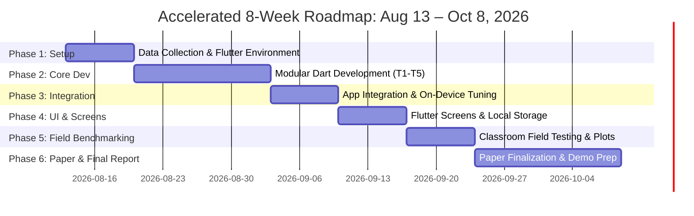

# Project Roadmap & Modular Team Assignment Plan

**Project Title**: Automated On-Device Classroom Attendance System — Flutter Mobile App
**Timeline**: Thursday, August 13, 2026 – Thursday, October 8, 2026 (~8 Weeks / 56 Days Execution Window)
**Team Structure**: 5 Teammates
**Platform**: Flutter (Dart), fully on-device (phone CPU/NPU) — no laptop, no server, no cloud. See `README.md` for the full architecture.

> **Note on this pivot**: this plan was originally Python/Streamlit-based (laptop-hosted). The team switched to a fully on-device Flutter app instead. The trade-offs that came with this switch — why Python is still needed for the research paper's evaluation, why the detector benchmark is scoped to 3 instead of 5, why this reshapes Phase 2 for every teammate — were discussed at length before committing, and are reflected in this version of the plan. If you weren't part of that discussion, read this note before assuming anything below is arbitrary.

---

## 1. Modular Role & Responsibility Distribution

Same 5-way split as the original plan, now re-scoped to Dart. Each teammate owns one module in `lib/modules/`:

| Teammate | Assigned Role & Module | In Plain Terms | Primary Responsibilities | Core Deliverables & Tools |
| :--- | :--- | :--- | :--- | :--- |
| **Teammate 1** *(Lead Architect, App Owner & Integration Coordinator)* | **Module 1: Video Ingestion (`lib/modules/video_ingestion/`), App Shell & Integration** | Teammate 1 builds the camera capture + app entry point, owns the shared `pubspec.yaml`, and is the one who merges all 5 modules into one working app. Since the app runs on everyone's own phone (not one hosting machine), the "owns the runtime" part of this role is lighter than it was in the Python plan — but integration itself is *harder*, because it now involves mobile build tooling (Android/iOS), not just a Python script. | • `frame_sampler.dart` — samples the recorded sweep video at a configurable rate (1–6 FPS). • `main.dart` / `app.dart` — app entry point + routing. • Camera capture via the `camera` package. • **Owns `pubspec.yaml`** — the shared dependency list every module builds against; adds/updates packages as needed (e.g., if a detector needs a new plugin). • **Owns Phase 3 integration**: merges each teammate's finished, tested Dart module into one working `flutter run` app; other teammates pair with Teammate 1 to fix their own module when something breaks during wiring. | • Working `frame_sampler.dart`. • App shell (`main.dart`, `app.dart`) that runs on a real device. • `pubspec.yaml` kept current and conflict-free. • Fully merged, installable app (Phase 3 output). |
| **Teammate 2** *(Computer Vision Preprocessing Engineer)* | **Module 2: Motion Blur Filtering & Homography (`lib/modules/blur_motion/`)** | Teammate 2 throws out blurry frames caused by the teacher walking/panning, and figures out how much the camera moved between frames — same job as before, just implemented in Dart via `opencv_dart` instead of Python's OpenCV. | • `blur_filter.dart` — Variance-of-Laplacian sharpness scoring via `opencv_dart`. • `homography.dart` — ORB/RANSAC feature matching + homography estimation, with the validity fallback (skip alignment, fall back to embedding-only matching) already noted in `docs/interface_contract.md`. | • Implemented `blur_filter.dart` (currently a stub — replace the `throw UnimplementedError`). • Implemented `homography.dart` (same). • Sharpness/homography threshold benchmarking notes. |
| **Teammate 3** *(Detection Benchmark Lead)* | **Module 3: Face Detection Benchmarking (`lib/modules/face_detection/`)** | Teammate 3 gets the app to find every face in a frame (including small ones in the back row), and benchmarks 3 detectors to see which is the best speed/accuracy trade-off on-device. | • `yunet_detector.dart` — YuNet ONNX via `flutter_onnxruntime` (primary, fastest). • `retinaface_detector.dart` — RetinaFace-MobileNet0.25 ONNX via `flutter_onnxruntime` (secondary, best rear-row recall). • `haar_cascade_detector.dart` — Haar Cascade via `opencv_dart` (classic-CV baseline, no model download needed, cheapest to add). • **Sources the ONNX model files**: YuNet and RetinaFace need pretrained weights exported/quantized to INT8 ONNX and placed in `assets/models/` (see README's Model Weights table) — this is new work that didn't exist in the Python plan, since Python's `insightface`/`onnxruntime` packages fetched these automatically. | • 3 working detector implementations behind the shared `detector_base.dart` interface. • `assets/models/yunet_int8.onnx` and `retinaface_mobilenet025_int8.onnx` sourced and committed (or documented download step). • Comparative detector evaluation data (feeds Teammate 5's Python analysis in Phase 5). |
| **Teammate 4** *(Biometric Recognition & Clustering Lead)* | **Module 4: Face Embedding & Identity Consolidation (`lib/modules/embedding_clustering/`)** | Once a face is found, Teammate 4 turns it into a numeric "fingerprint" (ArcFace) and groups repeated sightings of the same student into one identity — via a custom Dart clustering implementation, since scikit-learn doesn't exist on mobile. | • `arcface_embedder.dart` — ArcFace MobileFaceNet ONNX via `flutter_onnxruntime`; L2-normalizes the 512-d output per the interface contract. • `clustering.dart` — custom Dart Hierarchical Agglomerative Clustering (already stubbed with correct algorithm comments — needs the actual implementation, not just the `throw UnimplementedError`). • Sources/quantizes the ArcFace ONNX model file. | • Implemented `arcface_embedder.dart`. • Implemented `clustering.dart` (real HAC, not a stub). • `assets/models/arcface_mobilefacenet_int8.onnx` sourced and committed. |
| **Teammate 5** *(Roster Matching, Evaluation & Paper Lead)* | **Module 5: Roster Matching (`lib/modules/roster_matching/`) + Python Evaluation Pipeline** | Teammate 5 compares each student's fingerprint against the roster to mark attendance, **and** owns the one place Python still exists in this project: a small, separate analysis script that turns the app's exported results into the paper's ROC/PR curves and comparison tables — since no Dart library does this. | • `roster_db.dart` — `sqflite`-backed local roster store. • `cosine_matcher.dart` — cosine similarity + asymmetric threshold logic (τ_present/τ_match). • `evaluator.dart` — exports raw detection/match results as JSON/CSV from the app. • **New**: a small standalone Python script (not part of the Flutter app) that reads that exported JSON/CSV and produces ROC/PR curves, confusion matrices, and the detector comparison table using scikit-learn/pandas/matplotlib — this is the one piece of the project that's still Python, by necessity, not preference. | • `roster_db.dart`, `cosine_matcher.dart`, `evaluator.dart` implemented. • A small `analysis/` Python script + its own tiny `requirements.txt` (just scikit-learn/pandas/matplotlib, nothing else). • Research paper lead & literature comparison. |

> **Workload balance note**: **Teammate 1, Teammate 3, and Teammate 5 remain the three heaviest roles**, same as before the pivot, for similar reasons — Teammate 1 owns integration (now mobile-build-flavored, which is harder, not easier, than the Python version), Teammate 3 has 3 detectors to source models for and benchmark, and Teammate 5 carries the module *and* the standalone Python analysis step *and* the paper. Mitigation: same as before — Teammates 2 & 4 are the lighter roles and should be first to pair with Teammate 1 during Phase 3 integration if things slip, and paper-writing should be drafted incrementally per-module in Phase 3/4, not saved for Phase 6.

---

## 2. Weekly Sprint Roadmap (August 13 – October 8, 2026)

Dates are unchanged from the original plan — only the content of each phase changed.

---

### Phase 1: Environment Setup & Dataset Collection (Week 1: Thursday, Aug 13 – Wednesday, Aug 19)
**Goal**: Confirm the Flutter environment builds and runs for everyone, and record the sample classroom video dataset.

| Owner | Task | In Plain Terms |
| :--- | :--- | :--- |
| All | Install Flutter SDK (3.22+), Android Studio or VS Code + Flutter extension; confirm `flutter pub get && flutter run` works on a real device or emulator. | Get everyone's machine able to actually build and run the app before writing any module code. |
| Teammate 1 | Confirm `pubspec.yaml` (already scaffolded) covers everything the team needs; add packages as gaps are found. | Same role as owning `requirements.txt` before, just lighter now since the file already exists. |
| Teammate 3 & 4 | Source the ONNX model files: YuNet, RetinaFace-MobileNet0.25 (Teammate 3), ArcFace MobileFaceNet (Teammate 4). Export/quantize to INT8 ONNX, place in `assets/models/`. | This is genuinely new work vs. the Python plan — Python's `insightface` package fetched these automatically; on mobile, someone has to source and prepare them manually. Start this early, it can take longer than expected. |
| All *(review, not write from scratch)* | Read `docs/interface_contract.md` (already written as Dart model classes) and confirm everyone understands the shared data shapes before writing Module 2–5 code. | The interface contract already exists from the original plan — this phase is about making sure everyone's actually read it, not re-deriving it. |
| Teammate 1 & 5 | **Before recording**: obtain informed (parental/guardian) consent, since subjects are likely minors; document the process. Then record 10 sample classroom sweep videos across 3 classrooms (different lighting/distance/angle) and collect student reference roster photos. | Unchanged from the original plan — this part of the project doesn't depend on which framework you build in. |
| Teammate 5 | Begin hand-annotating ground-truth face boxes + student identities on a subset of the videos, in parallel with collection. | Also unchanged — still slow, still needs to start early to not block Phase 5. |

---

### Phase 2: Standalone Modular Development (Weeks 2–3: Thursday, Aug 20 – Wednesday, Sept 2)
**Goal**: Each teammate implements their assigned Dart module — turning the existing stubs (`throw UnimplementedError`) into real, tested code.

| Owner | File(s) to Implement | In Plain Terms |
| :--- | :--- | :--- |
| Teammate 1 (Module 1) | `frame_sampler.dart`, camera capture wiring (`camera` package), `main.dart`/`app.dart` scaffold. | Reads the recorded sweep video and pulls out frames at a configurable rate; wires up the camera and app entry point. |
| Teammate 2 (Module 2) | `blur_filter.dart`, `homography.dart`. | Replace the stubs with real `opencv_dart` calls — sharpness scoring and ORB/RANSAC homography. |
| Teammate 3 (Module 3) | `yunet_detector.dart`, `retinaface_detector.dart` (new), `haar_cascade_detector.dart` (new). Benchmark on-device latency for each. | Replace the stub with real ONNX Runtime / `opencv_dart` inference calls for all 3 detectors. |
| Teammate 4 (Module 4) | `arcface_embedder.dart`, `clustering.dart`. | Replace the stubs — real ONNX inference for embeddings, and the real HAC algorithm (the existing stub's comments already describe the correct algorithm; implement it). |
| Teammate 5 (Module 5) | `roster_db.dart`, `cosine_matcher.dart`, `evaluator.dart`. Also start the standalone `analysis/` Python script skeleton. | Real `sqflite` roster storage, real cosine-similarity matching, and a results-export function so the Python analysis script has something to read later. |
| Teammate 2, 3, 4, 5 — hard deadline: end of Phase 2 (Sept 2) | Push the module as real, tested Dart code (not stubs) that follows `docs/interface_contract.md`, plus a small `flutter test` proving it works on sample data. | Same discipline as the Python plan: Phase 3 should be "plug in tested pieces," not "debug from scratch on Teammate 1's build." |

---

### Phase 3: App Integration & On-Device Tuning (Week 4: Thursday, Sept 3 – Wednesday, Sept 9)
**Goal**: Merge all 5 modules into one working app, and tune it to actually run well on a phone.

| Owner | Task | In Plain Terms |
| :--- | :--- | :--- |
| Teammate 1 | Merge each teammate's Phase 2 module into one working `flutter run` app: `Video → Blur Filter → Face Detector (YuNet/RetinaFace/Haar) → ArcFace → Homography/HAC → Roster Match → Output`. | Same integration role as before, just now it's a mobile app build instead of a Python script — expect this to be the hardest phase, same as it was in the original plan. |
| Teammates 2, 3, 4, 5 | Pair with Teammate 1 to fix their own module when it breaks during wiring. | Same discipline as before — the person who wrote a module fixes it fastest when it breaks. |
| Teammate 3 & 4 | Test the app on at least 2–3 different real Android devices (different manufacturers if possible). | Android fragmentation is real — NNAPI behaves differently across OEMs, so "works on one phone" isn't the same as "works reliably." |
| Teammate 2 & 5 | Calibrate blur threshold (τ_blur) and roster threshold (τ_match) on a validation set via grid search. | Same as before — tune the two most important cutoffs by trying many values and keeping the best. |
| Teammate 4 | Calibrate clustering threshold (τ_cluster) on the same validation set. | Same as before — tune the cutoff deciding whether two fingerprints are "close enough" to be the same student. |
| Teammate 1 | Confirm the app performs acceptably on a mid-range (not flagship) phone — the actual target device, not the fastest one on the team. | Your research premise is "commodity hardware" — benchmark against a realistic device, not the best one available. |

---

### Phase 4: Flutter Screens & Local Storage (Week 5: Thursday, Sept 10 – Wednesday, Sept 16)
**Goal**: Build the actual teacher-facing app screens and finalize local data handling.

| Owner | Task | In Plain Terms |
| :--- | :--- | :--- |
| Teammate 1 | Build `home_screen.dart` and `capture_screen.dart` — the sweep recording flow. | The screens a teacher actually sees and taps through to record a sweep. |
| Teammate 5 | Build `results_screen.dart` (attendance list + CSV export via `csv`/`share_plus`) and `enrollment_screen.dart` (roster photo capture). | Where the teacher sees the attendance result and can share/export it, and where students get enrolled. |
| Teammate 2 & 3 | Build `processing_screen.dart` with a progress indicator, and add a detector-selection toggle (switch between YuNet/RetinaFace/Haar) for testing. | The "please wait" screen while the pipeline runs, plus an easy way to switch which detector is active for comparison. |

---

### Phase 5: Classroom Field Testing & Empirical Benchmarking (Week 6: Thursday, Sept 17 – Wednesday, Sept 23)
**Goal**: Run real field tests, and produce the paper's actual figures/tables using the one Python step in this project.

| Owner | Task | In Plain Terms |
| :--- | :--- | :--- |
| All | Install the app (`flutter build apk`, sideloaded) on real phones and test in 5 real classroom sweep scenarios. | Actually try the finished app on real devices in real classrooms, not just an emulator. |
| Teammate 3 | Export detector benchmark results (precision/recall/F1/IoU/on-device latency across YuNet, RetinaFace, Haar Cascade) via `evaluator.dart`. | Get the raw numbers out of the app so they can be analyzed. |
| Teammate 5 | Run the standalone Python `analysis/` script on the exported data to produce ROC/PR curves, confusion matrices, the detector comparison table, and accuracy-vs-speed plots. | This is the one place Python is actually used in the whole project — a small, separate script, not part of the app itself. |

---

### Phase 6: Research Paper Finalization & Live Demo Prep (Weeks 7–8: Thursday, Sept 24 – Thursday, Oct 8)
**Goal**: Write the final paper, finalize the app build, and prepare a live demo.

> **Note**: Same discipline as before — draft each module's Methodology subsection during Phase 3/4, not from scratch in Phase 6.

| Owner | Task | In Plain Terms |
| :--- | :--- | :--- |
| Teammate 5 (Lead) + All | Assemble and finalize research paper sections: Abstract, Problem Statement, Methodology, Literature Comparison, Empirical Results, Privacy Considerations. | Combine everyone's already-drafted sections into the final polished report. |
| Teammate 1 | Freeze the code repository; produce a release build (`flutter build apk` / `flutter build ios`); verify clean README setup instructions. | Lock the app so nothing breaks last-minute, and make sure anyone can follow the README to install and run it. |
| All | Conduct a dry-run live demonstration: record a sweep on a real phone → on-device processing → instant attendance roll-call output, no laptop involved. | Practice the actual live demo end-to-end — this is the moment the "no laptop needed" pitch actually gets shown off. |

---

## 3. Team Deliverables Checklist (By October 8 Deadline)

- [ ] **Working Software**: An installable Flutter app (APK, and IPA if iOS is pursued) that runs the full pipeline entirely on-device.
- [ ] **Core Codebase**: Modular, documented Dart code (`lib/modules/video_ingestion/`, `blur_motion/`, `face_detection/`, `embedding_clustering/`, `roster_matching/`) with no remaining `UnimplementedError` stubs.
- [ ] **`pubspec.yaml`** (owned by Teammate 1) that the whole merged app actually builds from.
- [ ] **ONNX model files** (`assets/models/`) sourced, quantized, and committed or documented.
- [ ] **The standalone Python `analysis/` script** (owned by Teammate 5) — the one deliberate exception to "no Python," scoped narrowly to evaluation/plotting.
- [ ] **Research Artifacts**:
  - `research_implementation_plan.md` (updated for the Flutter architecture).
  - `docs/interface_contract.md` (already exists, Dart-native).
  - Signed/documented consent records for classroom video & roster photo collection.
  - Ground-truth annotated subset of sweep videos (bounding boxes + identities) for benchmarking.
  - Detector Benchmarking Comparison Table (YuNet, RetinaFace, Haar Cascade).
  - Literature Comparison Table (vs. Static Image, Fixed-Camera Tracking, GPU-heavy, and cloud-based baselines).
  - ROC/PR curves & speed latency graphs (generated by the Phase 5 Python analysis script).
- [ ] **Final Research Paper / Project Report**: Complete manuscript ready for submission.

---

## 4. Full Summary — What Each Teammate Needs to Do

### Teammate 1
- Confirm the Flutter environment + `pubspec.yaml` work for everyone — Phase 1.
- Help obtain consent and record sample sweep videos + roster photos (with Teammate 5) — Phase 1.
- Build `frame_sampler.dart`, camera capture, and the app entry point — Phase 2.
- Own Phase 3 integration: merge all 5 modules into one working app.
- Confirm the app performs acceptably on a mid-range (not flagship) phone — Phase 3.
- Build `home_screen.dart` + `capture_screen.dart` — Phase 4.
- Join full-team classroom field testing — Phase 5.
- Freeze the repo, produce the release build, finalize README; help assemble the paper and run the live demo — Phase 6.

### Teammate 2
- Confirm local Flutter environment works; review the interface contract — Phase 1.
- Implement `blur_filter.dart` + `homography.dart`; hand off tested code by Sept 2 — Phase 2.
- Pair with Teammate 1 during integration to fix Module 2 issues; calibrate τ_blur (with Teammate 5) — Phase 3.
- Build `processing_screen.dart` + detector-selection toggle (with Teammate 3) — Phase 4.
- Join full-team classroom field testing — Phase 5.
- Draft the Module 2 Methodology section early; help run the live demo — Phase 6.

### Teammate 3
- Confirm local Flutter environment works; source/quantize the YuNet and RetinaFace ONNX model files — Phase 1.
- Implement `yunet_detector.dart`, `retinaface_detector.dart`, `haar_cascade_detector.dart`; benchmark on-device latency — Phase 2.
- Pair with Teammate 1 during integration to fix Module 3 issues; test on multiple real Android devices — Phase 3.
- Build the detector-selection toggle (with Teammate 2) — Phase 4.
- Export the full detector comparison data from field testing — Phase 5.
- Draft the Module 3 Methodology section early; help run the live demo — Phase 6.

### Teammate 4
- Confirm local Flutter environment works; source/quantize the ArcFace ONNX model file — Phase 1.
- Implement `arcface_embedder.dart` and the real HAC algorithm in `clustering.dart` — Phase 2.
- Pair with Teammate 1 during integration to fix Module 4 issues; calibrate τ_cluster — Phase 3.
- Join full-team classroom field testing — Phase 5.
- Draft the Module 4 Methodology section early; help run the live demo — Phase 6.

### Teammate 5
- Help obtain consent and record sample sweep videos + roster photos (with Teammate 1); begin ground-truth annotation — Phase 1.
- Implement `roster_db.dart`, `cosine_matcher.dart`, `evaluator.dart`; start the standalone Python `analysis/` script — Phase 2.
- Pair with Teammate 1 during integration to fix Module 5 issues; calibrate τ_match (with Teammate 2) — Phase 3.
- Build `results_screen.dart` + `enrollment_screen.dart` — Phase 4.
- Run the Python analysis script on field-test data to produce ROC/PR curves, confusion matrices, and comparison tables — Phase 5.
- Lead assembly of the final research paper; help run the live demo — Phase 6.
